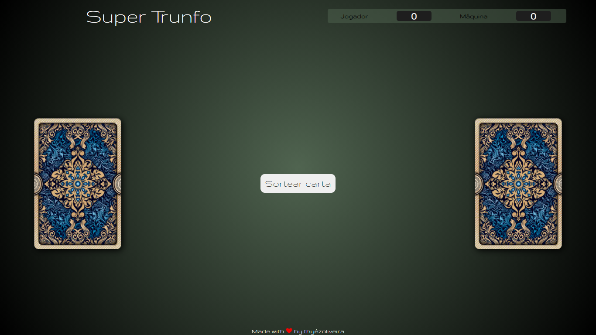
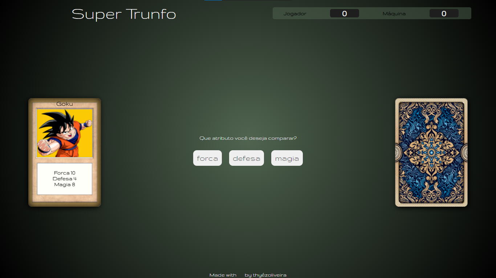

<h1 align="center"></h1>

 <h2 align="center">Jogo de cartas no estilo Super Trunfo.</h2>

<h1 align="center">Clique <a href="https://cdpn.io/thyezoliveiramonteiro/debug/vYgydYx/NQkzYKNgOWvA">aqui</a> para jogar online</h1>

# Como jogar?

<ol>
    <li>Clique em "Sortear cartas" para receber uma carta aleatória!</li>
    <li>Escolha o atributo da sua carta que deseja comparar. O atributo será comparado com o mesmo atributo da carta do oponete.</li>
    <li>Se o atributo escolhido na sua carta, for maior do que o mesmo atributo da carta do oponente. Você ganha um ponto! Se não, o oponete ganhará um ponto.</li>

</ol>

Feito com ❤ por Thyéz Oliveira, se gostou entre em <a href="https://www.linkedin.com/in/thyezoliveira/">contato</a>